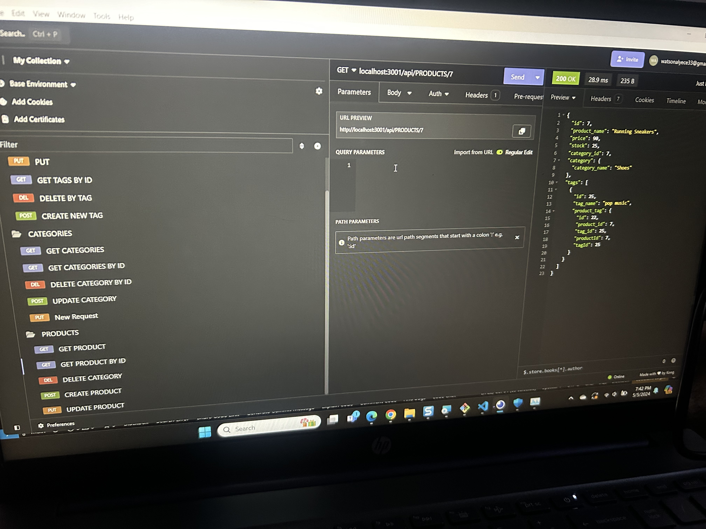

# Orm-challenge-1

### User Story
AS A manager at an internet retail company
I WANT a back end for my e-commerce website that uses the latest technologies
SO THAT my company can compete with other e-commerce companies

### Acceptance Critera
GIVEN a functional Express.js API
WHEN I add my database name, MySQL username, and MySQL password to an environment variable file
THEN I am able to connect to a database using Sequelize
WHEN I enter schema and seed commands
THEN a development database is created and is seeded with test data
WHEN I enter the command to invoke the application
THEN my server is started and the Sequelize models are synced to the MySQL database
WHEN I open API GET routes in Insomnia Core for categories, products, or tags
THEN the data for each of these routes is displayed in a formatted JSON
WHEN I test API POST, PUT, and DELETE routes in Insomnia Core
THEN I am able to successfully create, update, and delete data in my database

### Screenshot

### Installation

[Express.js](https://expressjs.com/en/starter/installing.html)

[MySQL](https://www.mysql.com/)

[Sequelize](https://sequelize.org/)

[Insomnia](https://insomnia.rest/)

### Usage

To run application take the following steps:
1. Clone my repo to your computer git@github.com:Watsonaj0316/Orm-challenge-1.git
2. Install and run express.js by running npm install expess.
3. After saving code run npm start.
4. Run npm start seed
5. Open new live server and type in localhost:3001 in Insomnia
5. Create different folders and to run Put, Post and Delete option

#### Author
[Alyece Watson] github:https://github.com/Watsonaj0316

#### Contact me with for questions
watsonalyece33@gmail.com